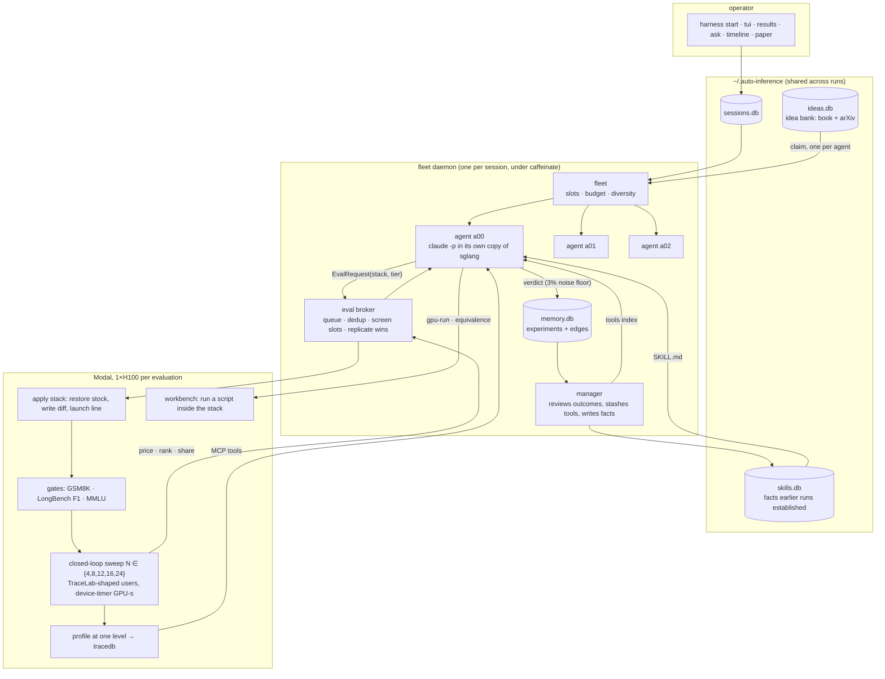

# auto-inference

Price an LLM serving stack the way a marketplace would, then let a fleet of
coding agents try to lower that price.

Give the **simulator** an inference stack (stock SGLang, or stock plus a diff
and a launch line) and it answers one question: *what effective price can
this stack serve OpenRouter's traffic for this model at, under a latency SLO,
and how much of that market can one node hold?* The **harness** runs Claude
Code agents that propose kernel-scale changes from an idea bank, prices each
one with the simulator, gates it on accuracy, and remembers what happened.



## Quick start

```bash
uv sync                          # everything, no GPU
uv run modal token new           # your own Modal account; nothing here is shared
make deploy                      # push the runner
make test                        # ~390 tests, offline
```

Then, in order, each once:

```bash
# 1. stock baselines on the fleet's grid, full and screen tier (~45 min, ~$4)
uv run simulate run --root runs/baseline        --levels 4,8,12,16,24 --seconds 120 --mkdir
uv run simulate run --root runs/baseline-screen --levels 8,12         --seconds 60  --mkdir

# 2. the token-equivalence reference for this model (~5 min, ~$0.40)
uv run simulate equivalence --root runs/equiv-ref --mkdir

# 3. fill the bank: the packaged seed set, then the arXiv feed
uv run harness ideas seed
uv run harness ideas arxiv -k 15 --model opus

# 4. a fleet
uv run harness --session build-1 start --agents 3 --evals 2 --model opus \
  --bank --manager --budget 200 --agent-budget 70 --max-attempts 4 \
  --baseline '{"bill_per_1k": <full>, "quality": {"gsm8k": <acc>, "longbench": <f1>, "mmlu": <acc>}, "screen": {"bill_per_1k": <screen>}}'
uv run harness --session build-1 tui

# 5. compound: start the next fleet from the best stack
#    (`harness results` names the run; --baseline is now that run's own report)
uv run harness --session build-2 start --agents 3 --evals 2 --model opus \
  --bank --manager --budget 200 --agent-budget 70 --max-attempts 4 \
  --base agents/build-1/a02/runs/attempt-001 \
  --baseline '{"bill_per_1k": <base full>, "quality": {...}, "screen": {"bill_per_1k": <base screen>}}'
```

Step 5 is the loop that compounds: every agent's "stock" becomes the base
(its edits, diff and no-change check are all relative to it), the stack it
evaluates is base plus its own edits, and bank claims are steered toward the
idea that produced the base. Repeat with the winner of each fleet -- or let
the campaign do it:

```bash
# 4+5, unattended: fleets in sequence, each on the last round's best
# publishable result, until the bill has halved or four rounds are spent
uv run harness --session camp-1 campaign start --rounds 4 --target 2.0 \
  --agents 3 --evals 2 --model opus --bank --manager --budget 200 \
  --agent-budget 70 --max-attempts 4 --baseline '{...}'
uv run harness campaign status --session camp-1     # rounds, bases, baselines, gain, the chain
uv run harness --session camp-1-r1 tui              # each round is an ordinary session
uv run harness campaign stop --session camp-1       # now; `harness --session camp-1-r2 stop` ends after that round
```

Round `n` runs as session `camp-1-r<n>` under `agents/camp-1/r<n>/`. When it
ends, the driver picks the round's best publishable result (falling back to
the best replicated win, and saying so), makes its run directory the next
`--base`, and sets the next `--baseline` from that run's own report -- the
full bill, the screen bill from the same stack's screen attempt (scaled by
the fleet's screen/full ratio when there was none) and its accuracy per
suite. Every idea earlier rounds tried is passed as `avoid`, and the base's
own idea seeds the claims. `agents/camp-1/campaign.json` is rewritten after
every round.

The baseline numbers come from step 1's reports. `harness start` refuses a
baseline it cannot score against, and refuses to start without a bank:
either one missing is a way the fleet runs all night and learns nothing. Step
2 is not checked, because the reference is built on first use -- running it
once up front just means no agent pays the five minutes for it.
`docs/methodology.md` has the findings that shaped these defaults and
`docs/examples/README.md` what a run leaves behind.

## How a stack is priced

1. **Sweep concurrency** with N closed-loop users replaying real coding-agent
   sessions (TraceLab) rescaled to the marketplace's token mix, 20,583 in and
   2,076 out per request. The highest N that holds the SLO (p90 TTFT ≤ 2,818
   ms, p90 TPOT ≤ 25 ms, mean TPOT ≤ 20 ms) is N\*. The report also prints
   where the binding metric crosses its limit by interpolation, because N\*
   is quantised to the grid and a level on the line flips on noise.
2. **Read GPU time by phase** at N\* from SGLang's CUDA-event device timer.
3. **Divide**: extend seconds over all input tokens, decode seconds over
   output tokens, at $3.00 per GPU-hour and 50% utilisation. No regression;
   cache hit rate is an outcome, not a control.
4. **Place it on the board**: the whole bill per 1,000 market requests
   against every OpenRouter provider for the model, and the share of daily
   demand one node serves at that price.

Stock SGLang 0.5.18 serving Qwen3.8-27B-FP8 on one H100 prices at $8.32 per
1k requests at N\*=12, rank 1 of 12 on the board, about 0.6% of the market
per GPU. The first fleet's best replicated change, an SLO-budgeted chunked
prefill sizer, took that to $6.94 with the model's outputs unchanged.

## The harness

Every service is a Protocol in `harness.contracts` and replaceable alone.
These six shape a run:

| service | question it answers |
|---|---|
| `IdeaBankService` | where ideas of the right size come from; content-addressed records, claimed one per agent, least similar first or steered by a seed |
| `AgentService` | one idea, iterated: recall → edit → check → screen → confirm → replicate |
| `EvalService` | the queue in front of the GPUs: dedup, screen slots, spend per attempt |
| `MemoryService` | every experiment with typed edges; a synthesised brief on recall |
| `SkillBankService` | facts earlier runs established; manager-written, agent-read, contradictions supersede |
| `OrchestrationService` | N agents kept diverse and inside a budget; the manager |

`ContextService` holds the transcripts behind those claims and `SessionStore`
the live snapshot a watcher reads; neither is something an agent calls.

**Agents are Claude Code processes.** Each runs `claude -p` in its own copy
of the `sglang` package with the tools it needs allowed, and the harness reads
the diff back. An agent starts from a bank record that names the
mechanism, target files, expected gain and risks; it is asked to write a design
note, run a correctness check and micro-benchmark on an H100 (`harness tool
gpu-run`) and score token equivalence against stock (`harness tool
equivalence`) before it spends a sweep. The launch line is the agent's too:
`serving.json` beside its code sets chunk size, memory fraction, scheduler
policy, extra flags or environment, hashed into the experiment; only model, GPU
count and the metrics switch are locked.

**What guards the number.** Every evaluation scores GSM8K exact match,
LongBench token F1 and MMLU before load, so a change gated on sequence length
exercised, and a stack that answers worse is rejected whatever it priced at. A
claimed win is measured twice and the worse run kept; verdicts are recorded as
win, loss or neutral against a 3% noise floor; screens are judged against stock
at screen tier. The token-equivalence check scores the prefill (teacher-forced
top-1 and logprob) and the decode path (greedy generation against stock's;
1.0000 on stock itself, and the only score a decode kernel cannot fake). Decode
agreement is a *label*, not a rejection: the result says `lossless` (≥ 0.80;
two correct kernels score 0.84 against each other) or `lossy`, and a lossy
change is allowed as long as the accuracy suites hold. It is one an agent runs
from its own shell, not a gate the pipeline applies -- the trace says whether
it did.

**Publishable means explained.** A win is publishable only when there is a
measured reason it is faster. `harness tool ablate --env KEY=VAL --tier screen`
prices the stack twice, as is and with the mechanism's kill switch set on the
server, and writes `ablations/<n>/ablation.json`: both prices, N\*, the share of
the delta the mechanism accounts for, and whether the disabled stack returns
to within 3% of baseline. Two sweeps of real money, run once on the diff that
won -- and run automatically: the agent declares its kill switch in
`ablation.env` beside its code (one `KEY=VAL` per line), and when a full-tier
win replicates the loop ablates it at screen tier on the spot, records the
verdict in the trace and the attempt, and never lets it fail the idea. A win
with no `ablation.env` stays `no-ablation`; `--no-auto-ablate` turns the
step off. `harness results` and the TUI show a `pub` column -- `yes`, `no`,
`no-replicate`, `no-ablation` -- from `results.publishable`: verdict win,
replicated, gates held, ablation explains it (`docs/methodology.md` §5f).

**Stalled calls are restarted, not waited on.** A `claude -p` that hangs
mid-stream looks exactly like one thinking hard. The stream reports every
message and tool result to the fleet, so a call in `thinking` that has
produced nothing for `--stall-minutes` (default 20) is cut: the slot's
`cancel` is set without its `stop`, the row says `stalled`, the loop records
a `stalled` turn, resets the workspace so the half-written diff is never
priced, and starts the next attempt of the same idea, counted against
`--max-attempts` and patience. A host sleep is not a stall; an operator's
stop or kill still ends the agent.

**What agents know.** Three skills are written into each agent's directory
before every edit and again into the paper directory before the write-up:
`tracedb`, the GPU profile as a database (captured on every full sweep at one
fixed concurrency, `--profile-level`, and served over MCP beside stock's
profile once one has been ingested); `writeup`, what a paper is here -- every
claim cites a file in the run directory, the mechanism section is hypothesis
plus the measurement that tested it, the publishable bar above; and
`serving-facts`, the skill bank. `HARNESS_EXTRA_SKILLS=/path/to/skill:/other`
adds skill directories from outside the repo (a LaTeX document skill for the
paper step, say), symlinked under `.claude/skills/<name>/`. The manager reviews
every few outcomes, stashes a reusable script under the run's `tools/` when it
can name the hours saved, and writes facts the evidence supports.

## Reading a run

```bash
uv run harness --session S tui            # fleet tab: agents, $/1k, rank, share, time by phase, recent calls
                                          # results tab: experiments best first, diff, `a` to ask Claude about the run
uv run harness --session S results --diff
uv run harness --session S ask "which attempt touched the attention backend?"
uv run harness --session S timeline       # ideas, phases, results, cost per agent; --html for a Gantt
uv run harness --session S paper          # write-ups, one per idea that reached a full sweep
uv run harness --session S calls -v       # every model call, per-message tokens and tools
uv run harness traces show <id> --root agents/S --kind eval_submit --full
uv run harness --session S spend          # Modal dollars: evaluations, the agents' own GPU tools, orphans
uv run harness skills list                # the facts
uv run harness ideas claim --seed "..."   # one record, steered; `ideas related <id>` for its neighbours
uv run harness delete --session S         # wipe a finished fleet's directory and rows
```

Pause is `p`, resume is `r`; an agent never resumes on its own. The daemon
runs on the machine you started it from, under `caffeinate`; a closed lid still
freezes it, and the status line says so.

## Layout

```
src/simulator/    the pricing: stack, sweep runner (Modal), SLO, market, quality gates, plots
src/harness/      the loop: contracts, agent, orchestration, ideas, skills, manager, tui
src/tracedb/      GPU profiles as a queryable database, with an MCP server
docs/methodology.md   how the method was arrived at, with every negative result
src/harness/ideas/seeds/   the packaged idea-bank seed set (the book's 27 mechanisms)
docs/examples/        what a run leaves behind, one tree per kind of run
runs/, agents/        your artifacts; ignored by git, as is docs/NEXT.md (your planning notes)
```

## Assumed, not measured

$3.00 per GPU-hour, 50% utilisation, break-even pricing, the SLO above, and the
market snapshot's demand and provider prices (`make market` refreshes it).
Everything else in a report comes from a GPU timer.
